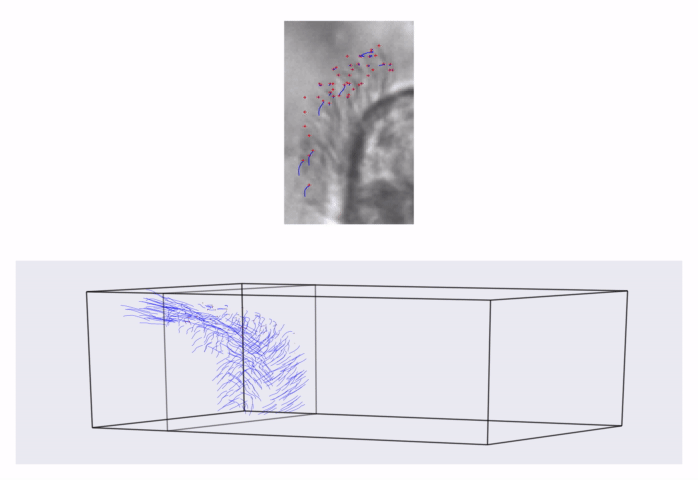
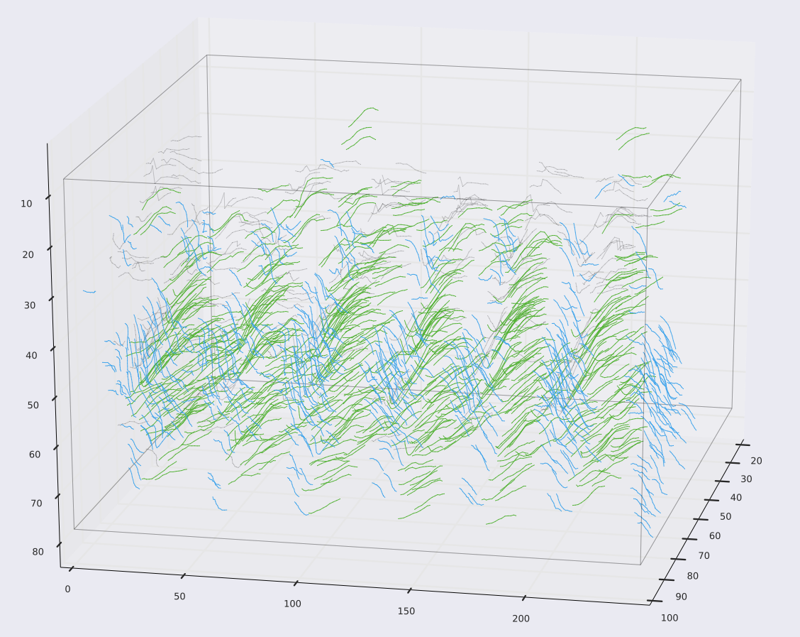
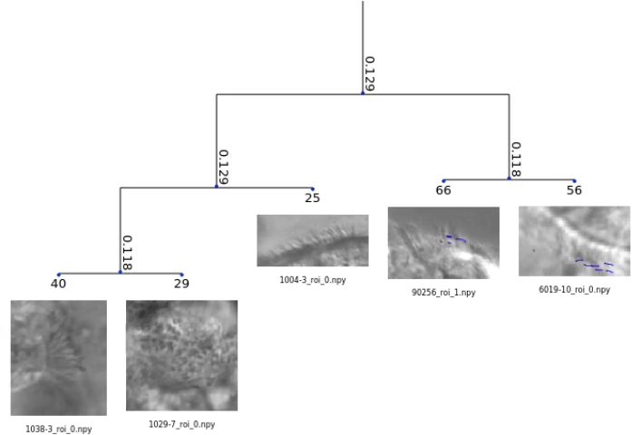

Project for clustering trajectories in cilia videos for identifying common motion patterns.

### Pipeline
1. Compute trajectories and trajectory based features

2. Cluster trajectories in regions of interest separately for multiple feature spaces 

3. Fuse multiple feature clusters

4. Use hierarchical agglomerative clustering to cluster together similar motions among entire dataset

### References
Wang, Heng, et al. "Dense trajectories and motion boundary descriptors for action recognition." International journal of computer vision 103.1 (2013): 60-79.

Anjum, Nadeem, and Andrea Cavallaro. "Multifeature object trajectory clustering for video analysis." IEEE Transactions on Circuits and Systems for Video Technology 18.11 (2008): 1555-1564.
